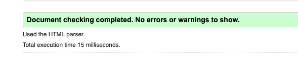
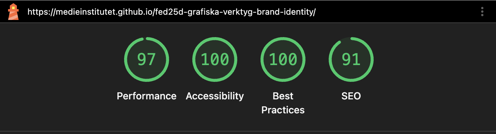
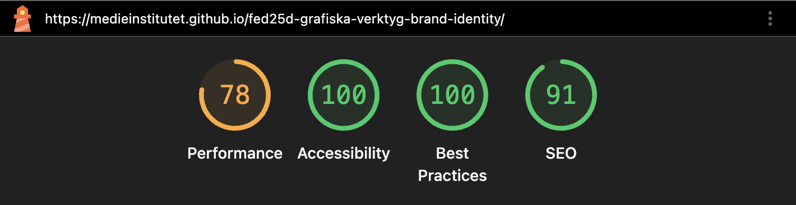

[Live link](https://github.com/isabelletherese/fed25d-inl-golden-arches-perfumerie)

# About the project
Golden Arches Parfumerie is a fictional luxury perfume brand built as a school project at Medieinstitutet. The site was developed by a team of four frontend developer students, based on a design created by a separate team.

The project is built with HTML, SCSS and TypeScript and bundled with Vite. It features a fully responsive layout with a mobile-first approach, a hamburger menu for mobile navigation, smooth scroll animations using GSAP, and interactive product cards. The codebase follows a component-based SCSS structure with consistent use of CSS custom properties for theming.

## Technologies

### 💻 Development & Frontend

### 🛠️ Tools & Quality

### 🚀 Version Control & Deployment

#### Developed by CMYK team:

[Erik Grahn](https://github.com/erik-grahn),
[Isabelle Reynolds](https://github.com/isabelletherese),
[Märta Törnqvist](https://github.com/martatornqvist),
[Filip Brandt](https://github.com/filip-brandt)

## Desktop 

## Tablet 

## Mobile 

#### Accessibility: 

### W3C HTML Validator

### Lighthouse – desktop

### Lighthouse – mobile

# About the design
This project is based on the concept: What if McDonald’s created luxury perfumes?
The design team wanted to combine something familiar and playful with a more exclusive and modern visual style. The contrast between fast food and luxury became the core idea behind the design and helped create a memorable and unique user experience.

The overall design uses a minimal and clean layout to give the products more focus and create a premium feeling. With plenty of spacing, clear hierarchy and simple navigation to avoid visual clutter and make the page easy to explore.

The color palette is inspired by McDonald’s branding, mainly using black, white and grayscale tones together with yellow accent colors. The darker and neutral colors help create a more luxurious atmosphere, while the yellow highlights connect the design to the McDonald’s identity and draw attention to important interactive elements.

We used different fonts to strengthen the visual identity of the project.
For headings, we chose Bodoni Moda SC because it gives a more elegant and editorial look that matches luxury perfume branding. For body text, we used Roboto Condensed to keep the content clean and readable. Product names use Cormorant to create a more sophisticated feeling and help separate them visually from the rest of the content.

The navigation is simple and placed at the top of the page to make the structure easy to understand. On mobile devices, the navigation changes into a hamburger menu to improve usability and save space.

Interactive details and animations were added to make the page feel more dynamic without becoming distracting. Product cards change from grayscale to color on hover, and buttons include subtle hover effects to guide the user naturally through the page. We also used smooth transitions and scroll effects to create a more modern browsing experience.

The website is fully responsive and designed for mobile, tablet and desktop. The layout adapts depending on screen size while keeping the same overall style and user experience across all devices.

### Designed by Brand Identity team: 
[Alexander Johansson](https://github.com/AlexJCodes),
[Markus Jönsson](https://github.com/Crestedgaming),
[Gustav Gereonsson](https://github.com/gulumige),
[Alexander Gerhard](https://github.com/alexgeho)
